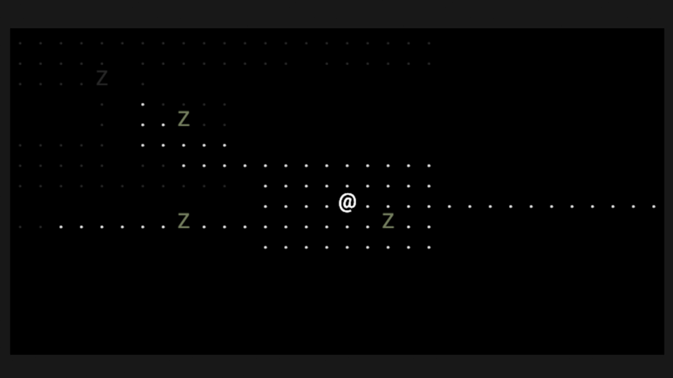

# Roguelike

## What is a Roguelike

Roguelike is a subgenre of role-playing video game characterized by a dungeon crawl through procedurally generated levels and turn-based gameplay.

__This repo are some ideas for the [7DRL Challenge 2019](https://itch.io/jam/7drl-challenge-2019).__

## Tasks

- [x] Scenes
- [x] Dungeons
- [x] Tiles
- [x] Hero
- [x] Enemies
- [x] FOV
- [ ] IA + Pathfinding
- [ ] Items

## Screenshot

  

